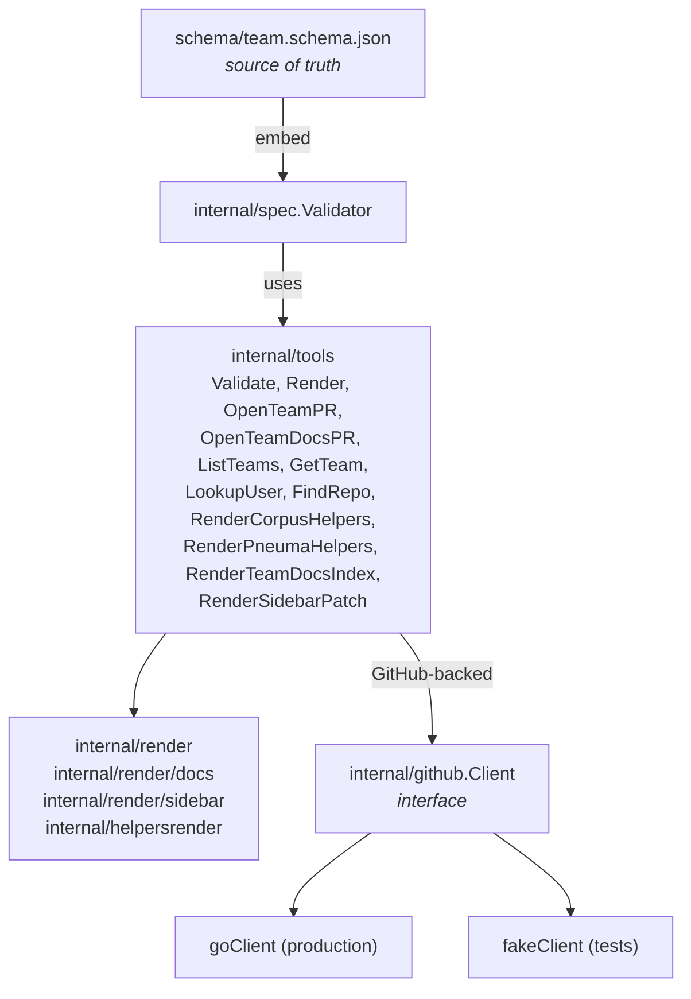

# pt-techne-mcp-server — internals

This is a tour for new contributors. Read it top to bottom before changing
code.

## Layout

```none
cmd/pt-techne-mcp-server/   — main; wires SDK, registers tools, serves stdio
internal/spec/              — typed Team struct + JSON Schema validator
internal/render/            — canonical HCL emitter (pt-logos tfvars)
internal/render/docs/       — team docs index page renderer (pt-ekklesia-docs)
internal/render/sidebar/    — sidebars.js patcher (pt-ekklesia-docs)
internal/helpersrender/     — surgical inserter for logos_workspaces in
                              pt-corpus / pt-pneuma helpers.tofu
internal/github/            — narrow Client interface + go-github wrapper
internal/tools/             — thin MCP adapters around spec + render + github
internal/schemadoc/         — generator for docs/schema.md
schema/team.schema.json     — single source of truth for the team spec
docs/                       — human-readable documentation (some generated)
```

Hard rules:

- **One concept per file.** No `helpers.go`/`util.go`/`common.go`.
- **No `pkg/`** — everything is `internal/`.
- **Interfaces only with two implementations.** `internal/github.Client`
  is the first one in the repo: real go-github wrapper + in-memory
  fake under `internal/tools/*_test.go`.
- **No `init()` and no globals.** Wire dependencies in `main.go`.
- **Keep non-test Go LOC proportional.** The repo has grown past the
  original 1500-line target; complexity is acceptable when it maps 1:1
  to distinct tools. Favour small, focused files over large ones.

## How the pieces fit



The schema lives in `internal/spec/schema_embed.json` (the canonical copy used
via `//go:embed`). The `schema/team.schema.json` path is a symlink for
repo-level discoverability.

## Read tools vs write tools

`open_team_pr` and `open_team_docs_pr` are **writers**. The four pt-logos
readers — `list_teams`, `get_team`, `lookup_user`, `find_repo` — share a
common shape implemented in `internal/tools/team_source.go`:

1. `listTeamFiles` — `ListDir teams/` on `pt-logos@main`.
2. `fetchAllTeams` — bounded-concurrency fan-out (`errgroup` with
   `SetLimit(8)`) of `GetFile` + `spec.Parse` + schema validate per team.
3. Tool-specific transformation of the parsed `[]*spec.Team` into the
   typed output.

The two helpers renderers — `render_corpus_helpers` and
`render_pneuma_helpers` — are also reads, but against sibling repos
(`pt-corpus`, `pt-pneuma`) rather than `pt-logos`. They use
`Client.GetFileInRepo` to fetch each repo's `helpers.tofu`, then call
`internal/helpersrender.Render` to splice in one new line for the
team's `<team_key>-main-production` workspace and return the canonical
updated bytes. No writes — the agent is responsible for landing the
output (typically by checking the bytes into a PR with the same tooling
it already uses for `helpers.tofu` edits).

The docs tools (`open_team_docs_pr`, `render_team_docs_index`,
`render_sidebar_patch`) and `get_team` target `osinfra-io/pt-ekklesia-docs`
using the same `*InRepo` family of methods on the GitHub client
(`GetFileInRepo`, `ListDirInRepo`, `GetRefInRepo`,
`CreateOrUpdateFileInRepo`, `ListOpenPRsInRepo`, `CreatePRInRepo`, etc.).

`spec.Parse` (the inverse of `render.Render`) uses
`hashicorp/hcl/v2/hclsyntax` to evaluate the `teams` attribute to a cty
value, then strict-decodes via JSON into `spec.Team`
(`DisallowUnknownFields`). The renderer's inline `display_name`
etymology comment is recovered with a small regex against the raw bytes
— the only piece that the HCL grammar drops.

A failed parse or schema validation surfaces as a non-retryable
`source_parse_error`: a human edit on `pt-logos` introduced data that
this server's schema does not accept, and retrying will not help.

## `open_team_pr` flow

`open_team_pr` mutates `osinfra-io/pt-logos`. It runs a deterministic
transaction:

1. Validate (shared validator).
2. Render (shared renderer) → bytes.
3. Find any open PR for `team/<team-key>` → `main`.
4. Resolve branch state via `CompareCommits`: missing → create from
   main; identical/ahead → reuse; behind → fast-forward; diverged with
   open PR → error; diverged without an open PR → reset (the branch is
   disposable when no human PR depends on it).
5. Read the file at the branch and at `main`. Two noop short-circuits:
   branch matches AND PR open; or main matches AND no PR.
6. Commit (with one 409/422 reconciliation retry that may collapse
   into a noop).
7. Reuse the open PR (no title/body edit — preserves human edits) or
   open a new one (with one 422 reconciliation that maps to
   `action: "updated"` if a parallel call won the race).

## `open_team_docs_pr` flow

`open_team_docs_pr` mutates `osinfra-io/pt-ekklesia-docs`. It follows
the same idempotent transaction pattern as `open_team_pr` but commits
two files (the docs index page and `sidebars.js`) on a
`team-docs/<team_key>` branch:

1. Validate the spec (shared validator).
2. Render docs index via `internal/render/docs`.
3. Render sidebar patch via `internal/render/sidebar`.
4. Resolve branch state (same branch lifecycle as `open_team_pr`).
5. Per-file commit (index, then sidebars) — each is a noop if unchanged.
6. Reuse or open PR.

## How to add a new MCP tool

Three files, no router abstraction:

1. **Pure function** in `internal/<package>/` for the actual behavior.
2. **Adapter** in `internal/tools/<tool_name>.go` that decodes input,
   calls the function, returns the typed output.
3. **Registration** in `cmd/pt-techne-mcp-server/main.go` — add one line:
   `tools.MyTool(server, deps...)`.

Use a typed input/output struct with `jsonschema:"…"` field tags. The MCP
SDK auto-derives the JSON Schema from the type — keep the struct shallow
(no `json.RawMessage`, no embedded interfaces) so the derived schema is
clean.

**Exception: `Spec any` fields.** LLMs sometimes double-encode object
parameters as JSON strings during parallel tool calls. The go-sdk validates
raw JSON against the generated schema *before* unmarshaling into the handler
struct, so `map[string]any` (which generates `{"type": "object"}`) rejects
strings at the schema layer. Using `any` generates an unrestricted `{}`
schema that passes both forms. All spec-accepting tools use `Spec any` +
the `coerceSpec()` helper in `internal/tools/flex_spec.go` to normalize the
input to `map[string]any` at handler time.

## Renderer

`internal/render/render.go` is a hand-written emitter, not a `text/template`.
The reason: the canonical pt-logos style requires per-block alignment of `=`
signs across heterogeneous keys, which is awkward in Go templates. The emitter
uses a single `bytes.Buffer` and a tiny `writer` helper. Maps are walked in
sorted key order so output is deterministic.

Field order inside a team body is enumerated explicitly by `emitTeamBody`.
That function is the contract: if you add a new top-level team field, add it
there in the right alphabetical position.

`internal/helpersrender/render.go` is a different shape of renderer with a
different contract: instead of producing a whole file from a typed spec,
it surgically edits an existing `helpers.tofu` from a sibling repo and
inserts one new entry into the `logos_workspaces` list. The contract:

- **Byte-identical noop.** If the workspace is already present, the input
  bytes are returned unchanged.
- **Minimal diff.** Only the bytes for the new line are added; existing
  entries, comments, indentation, line-ending style (LF/CRLF), and
  trailing-comma convention are preserved exactly.
- **Strict input shape.** Exactly one `module "core_helpers"` block with
  exactly one `logos_workspaces` attribute; the attribute must be a list
  literal of plain string literals. Anything else is rejected with
  `source_parse_error` rather than guessed at.

The implementation parses with `hashicorp/hcl/v2/hclsyntax` to locate
the list and read its existing string values, then byte-splices a new
line into the source at the correct position. `hclwrite` was considered
and rejected: its token-level rewriting normalizes formatting in ways
that fight the byte-identical-noop contract.

## Tests

- **`internal/render/testdata/parity/*.json`** — hand-authored JSON spec for
  each real pt-logos team. The test renders each one and compares to a
  golden `.tfvars`. **Run with `RENDER_UPDATE=1 go test ./internal/render/...`
  to regenerate goldens after intentional output changes.**
- **`internal/spec/parse_test.go`** — round-trip parity: for every parity
  input the renderer produced, `spec.Parse` reproduces the original
  spec. This is the contract that makes "spec ↔ tfvars round-trip is
  byte-stable" enforceable rather than aspirational.
- **`internal/spec/validate_test.go`** — table-driven validation cases.
- **`internal/tools/read_tools_test.go`** — read-tool tests using the
  in-memory fake seeded with the renderer goldens.
- **`internal/tools/render_helpers_test.go`** — helpers renderer tests
  (corpus + pneuma workspace insertion, noop, parse errors).
- **`internal/tools/docs_render_test.go`** — docs index + sidebar patch
  renderer tests.
- **`internal/tools/open_team_docs_pr_test.go`** — end-to-end docs PR
  transaction test using the in-memory fake.
- **`internal/tools/flex_spec_test.go`** — double-encoding coercion tests.

The parity fixtures are the regression net. If you change the renderer, run
the parity test and inspect every golden diff.

## Releasing

Tag, push, done.

```sh
git tag v0.1.1
git push origin v0.1.1
```

The release workflow builds `linux/{amd64,arm64}` binaries, attaches them
to a GitHub release, and pushes a multi-arch image to
`ghcr.io/osinfra-io/pt-techne-mcp-server:<tag>` and `:latest`.
